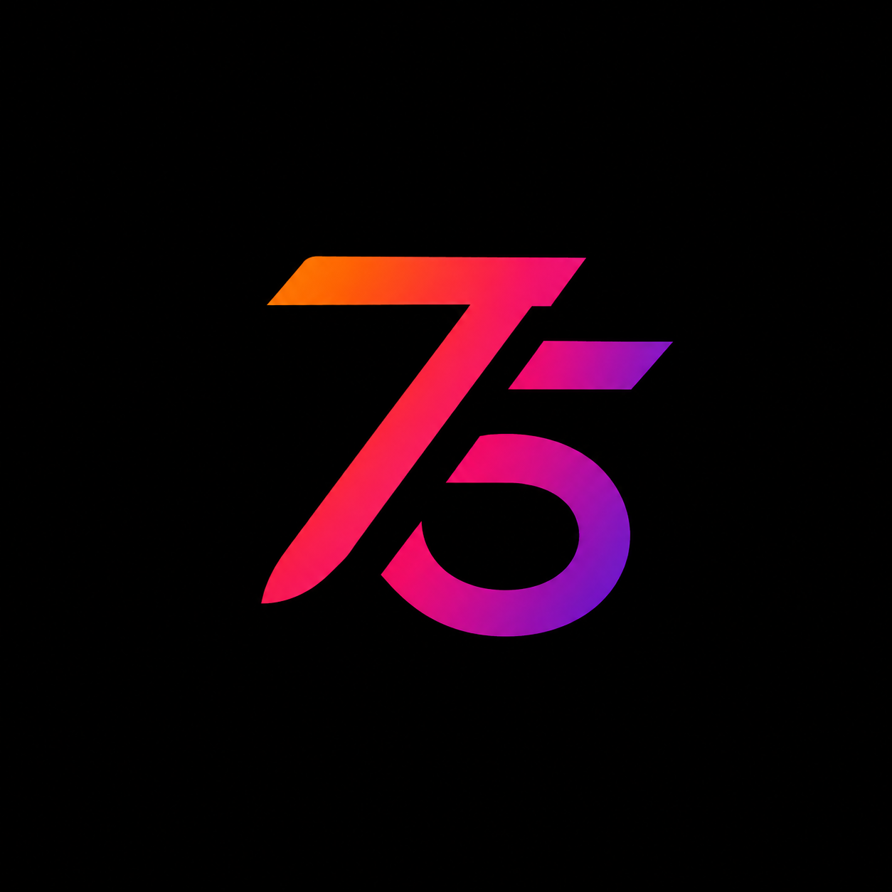

  

<h1 align="center">75Neo</h1>

  <strong>Where passion powers innovation.</strong>

  Building intelligent software. 
  Engineering products that scale.

## About

75Neo is an engineering-driven software company focused on building modern software, AI-powered products, and scalable SaaS platforms.

We believe great products are created by passionate engineers, thoughtful architecture, and relentless execution.

## What We Build

- 🤖 Artificial Intelligence
- ☁️ Cloud Native Solutions
- 🚀 SaaS Platforms
- ⚡ High-performance APIs
- 🏗️ Software Architecture
- 🛠️ Developer Tools
- 🔐 Infrastructure & Security

## Engineering Principles

- Simplicity over complexity.
- Build for the long term.
- Quality is never optional.
- Performance matters.
- Ship fast. Improve faster.
- Automate everything possible.
